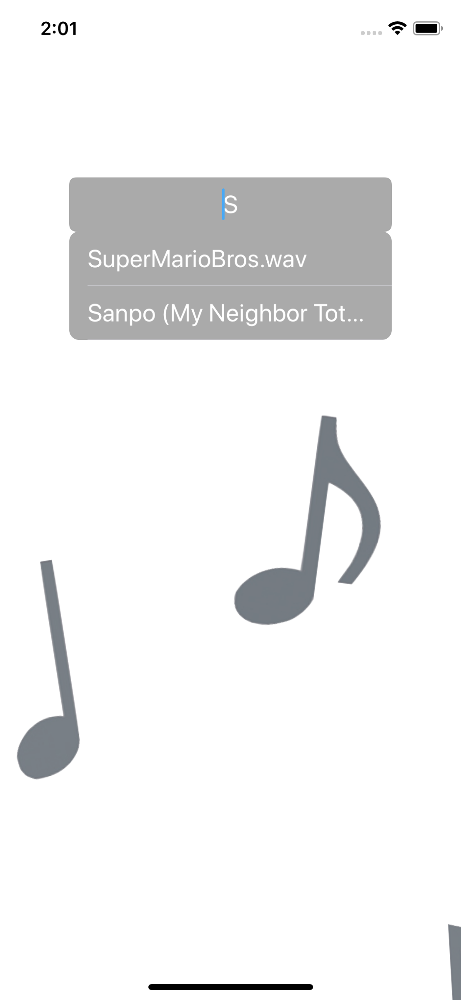
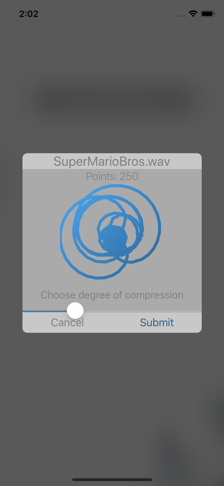
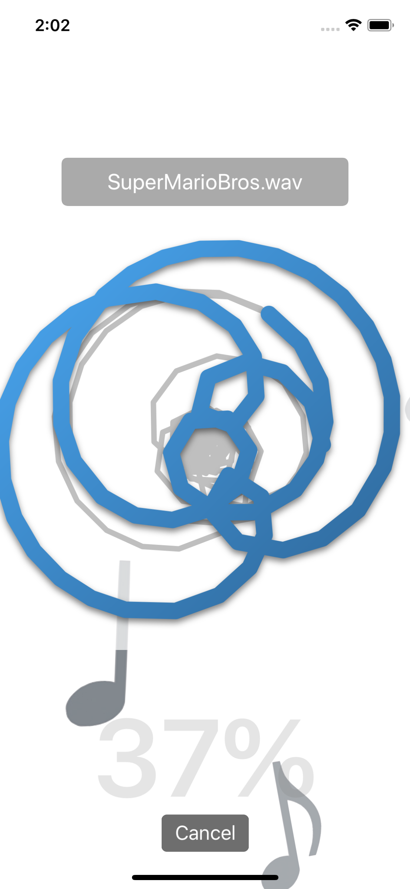

## FFT-Printer
This was part of the SPAJAM2018 hackathon. It is an iOS app that lets you choose a song, upload to the raspberry pi server for FFT conversion, choose a level of compression for printing, and watch print progress in real time.

